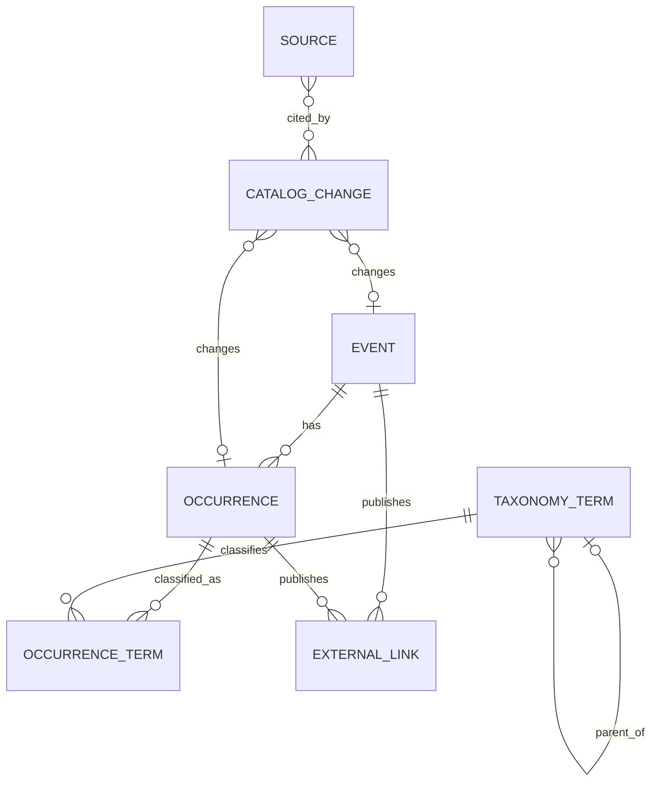

# Domain model

Status: Draft; product constraints confirmed in the foundation spec  
Scope: Logical records, invariants, identity, evidence, and publication

Implementation note (2026-10-02): Source evidence requirements and storage in this specification are deferred until the catalog database update workflow is implemented. Current catalog writes, publication, and audit history do not require or store source excerpts, snapshots, or field-level evidence. Date, location, scope, versioning, and audit rules remain active. The detailed evidence rules below describe the intended later workflow.

## 1. Context and boundaries

This model defines records and invariants for the [first release](000-product-foundation.md). It separates durable Event identities from dated Occurrences, and source evidence from accepted catalog values. Unknown facts remain unknown. [ADR 001](../docs/decisions/001-sqlite-and-drizzle.md) selects SQLite and Drizzle; this model does not prescribe table layout.

## 2. Modeling principles

AI extraction is input, not evidence; validate against sources before a write. Keep accepted change history immutable. Temporal state, map features, and search documents are projections, not competing sources of truth. Logical value objects do not each require a table or service.

## 3. Model overview



`ExternalLink` and `CatalogChange` have exactly one owner/subject even though the conceptual diagram shows both possible target types. `OccurrenceTerm` always belongs to one Occurrence.

Catalog records are Event, Occurrence (including venue/location), TaxonomyTerm, OccurrenceTerm, and ExternalLink. Source identifies external locations; CatalogChange holds applied change history and, when implemented, supporting evidence. A one-off Event has one Occurrence; a recurring Event may have many. “Candidate” means a discovered or unpublished Event/Occurrence, not a separate entity. V1 has no Observation, Proposal, approval queue, or review state.

## 4. Common types

These are logical types, not storage instructions.

| Type | Meaning |
| --- | --- |
| `Identifier` | Opaque, stable identifier. Never derived from a slug, name, URL, or year. |
| `Slug` | Human-readable URL segment, unique within its declared scope. |
| `LocalDate` | ISO 8601 calendar date (`YYYY-MM-DD`) without a time or UTC conversion. |
| `Instant` | ISO 8601 timestamp representing an absolute moment, stored/compared in UTC. |
| `CountryCode` | ISO 3166-1 alpha-2 country code. |
| `LanguageCode` | BCP 47 language tag when language is known. |
| `TimeZone` | IANA time-zone name such as `Europe/Lisbon`, never a fixed UTC offset. |
| `Url` | Absolute, normalized HTTP(S) URL. The originally observed form may remain in evidence. |
| `Coordinates` | Latitude and longitude as one atomic value. |
| `SubjectRef` | Logical reference to exactly one Event or Occurrence. Physical implementations should prefer explicit relations over unconstrained polymorphic strings. |
| `ActorRef` | A human or system identity used for audit. It does not require user accounts in the MVP. |

All mutable catalog records have `createdAt`, `updatedAt`, and a monotonically increasing `version` for optimistic concurrency. Immutable audit records have a creation timestamp and are never updated.

## 5. Catalog records

### 5.1 Event

An Event is the durable public identity and content container. It may describe a recurring concept such as "Wacken Open Air" or a one-off event with exactly one Occurrence.

| Field | Required | Meaning |
| --- | --- | --- |
| `id: Identifier` | yes | Stable internal identity. |
| `slug: Slug` | yes | Canonical public URL segment. |
| `canonicalName: string` | yes | Preferred public name, preserving meaningful casing and diacritics. |
| `aliases: string[]` | no | Former, localized, or matching names. Not displayed as translations by default. |
| `summary: string` | no | Validated editorial summary, not raw extracted copy. |
| `publicationState` | yes | `draft`, `published`, or `withdrawn`. |

Notes:

- An Event does not own dates, a map point, capacity, cancellation status, or classifications; those can change per Occurrence.
- Separate recurring festivals under one brand in different countries/locations are separate Events. A single festival relocating between years keeps its Event identity. Geography alone must not split a relocation or merge distinct parallel festivals; use official identity and continuity. Brand grouping is deferred.
- Changing a published slug must retain a redirect from the previous slug.
- Withdrawal hides an Event from public discovery without destroying its history.

### 5.2 Occurrence

An Occurrence is one dated or announced realization of an Event. Separate continuous periods, such as two festival weekends, are separate Occurrences under the same Event (for example `2027-weekend-1` and `2027-weekend-2`). Do not represent the gap as festival days.

| Field | Required | Meaning |
| --- | --- | --- |
| `id: Identifier` | yes | Stable internal identity. |
| `eventId: Identifier` | yes | Owning Event. |
| `occurrenceKey: string` | yes | Stable key unique within the Event, e.g. `2027` or `2027-summer`. |
| `displayName: string` | no | Occurrence-specific title only when it differs meaningfully from the Event name. |
| `occurrenceYear: integer` | for publication | Human-facing year. It is not an identity or uniqueness constraint. |
| `startsOn: LocalDate` | conditional | First calendar day at the event location. |
| `endsOn: LocalDate` | conditional | Last calendar day, inclusive. Same as `startsOn` for a one-day event. |
| `dateState` | yes | `unknown`, `provisional`, or `confirmed`. |
| `scheduleStatus` | yes | `announced`, `scheduled`, `postponed`, or `cancelled`. |
| `ticketAvailability` | yes | `unknown` (default), `available`, or `sold_out`; latest supported edition-level ticket availability, independent of schedule status. |
| `capacityEstimate: integer` | no | Source-backed occurrence-specific estimate of maximum or planned attendance capacity. |
| `publicationState` | yes | `draft`, `published`, or `withdrawn`. |
| `venueName: string` | no | Venue, park, farm, or event-site name when known. |
| `venueAddress: string` | no | Validated display address when known. |
| `locality: string` | no | City, town, or nearest settlement. |
| `administrativeArea: string` | no | State, province, county, or equivalent. |
| `countryCode: CountryCode` | no | Country containing the location; required for publication. |
| `coordinates: Coordinates` | no | Latitude and longitude as one atomic value, stored as columns on Occurrence. |
| `coordinatePrecision` | yes | `exact`, `approximate`, `locality`, `region`, or `unknown`. |
| `timeZone: TimeZone` | no | Time zone at the venue when known. |

Date rules:

- `startsOn` and `endsOn` are either both present or both absent.
- When present, `endsOn >= startsOn`.
- `dateState = unknown` requires both dates to be absent.
- Publication requires both dates to be present. Unknown-date Occurrences remain internal drafts.
- Both `provisional` and `confirmed` dates qualify for publication when supported by evidence. Provisional dates must carry a visible "Tentative dates" label wherever dates are displayed, including map previews, lists, and detail pages. A forecast inferred from previous years is not a source-backed provisional date.
- `scheduleStatus = scheduled` requires dates to be present.
- `announced`, `postponed`, and `cancelled` may have known dates. For an already-published Occurrence postponed without replacement dates, retain the previous date pair and its original date state as historical context, set `scheduleStatus = postponed`, and label the range "Previous dates" beneath "Postponed — new dates TBA." Those dates no longer represent an active schedule. Accepting replacement dates updates the same Occurrence and records the old values in CatalogChange; it does not create a new Occurrence merely because dates moved.
- `occurrenceYear` does not have to equal the year of `endsOn` for occurrences crossing New Year.
- Month-only, season-only, and similar source text remains in extraction output or change evidence until exact or explicitly provisional dates can be represented without invention.
- The date pair represents the public event programme covered by this Occurrence. Do not substitute campsite, gate, accommodation, ticket-sale, build, or strike windows. When an official source presents main days plus satellite programming, define and evidence the chosen public boundary; do not silently widen it or bridge discontinuous periods.
- A confirmed fallow year or explicit statement that no edition will take place is evidence of absence, not a cancelled Occurrence. Do not create a placeholder Occurrence for it.

`displayName` may carry a source-backed edition label or annual theme, for example `Kiwiburn 2027: Moss & Microchips`, without changing the durable Event name. A separately queryable theme field is deferred until a product feature requires it.

“Upcoming,” “ongoing,” and “completed” are a derived `temporalState` based on the current date, the Occurrence's local date range, and schedule status. Do not persist it as canonical data. Postponed and cancelled Occurrences have no active temporal state: never classify them as upcoming, ongoing, or completed from their previous dates.

Ticket availability rules:

- Set `sold_out` only from an explicit edition-wide statement by the organizer or authorized ticket seller. A sold-out tier, day, campsite, or allocation alone does not establish this. Closed/not-yet-open sales, missing ticket links, and failed checks are not evidence of sell-out.
- `available` means general-admission tickets were offered by an official/authorized source when checked, not guaranteed checkout availability. Retain partial-day or pass restrictions in price/attendance details. Otherwise start at `unknown`; unticketed events also need no ticket-availability claim.
- Availability changes require source evidence and audit history. Retain URL and check time with the applied change evidence, not a public freshness timestamp. Missing extraction or failed checks preserve the accepted value; supported ticket reopening may change `sold_out` to `available`. New editions start at `unknown`.
- Sold-out editions remain discoverable and eligible as the next Occurrence. Show a “Sold out” badge in list/map previews and details; do not infer “Available” from `unknown`. No availability filter is introduced in v1.

Location and venue fields belong to the Occurrence and are stored in its row, not in a separate Venue table. Each Occurrence has one location snapshot, preserving its history when a later edition moves or a venue is renamed.

Location rules:

- Latitude and longitude must either both exist or both be absent.
- Latitude is between -90 and 90; longitude is between -180 and 180.
- `[0, 0]` is a real location and must never be used as an unknown marker.
- `coordinatePrecision = unknown` requires coordinates to be absent.
- Publication requires a source-backed `countryCode` and an exact venue or at least an approximate locality/region within that country. A country alone is insufficient, and an unqualified locality/region without its country is unsafe in a worldwide catalog; records missing either part remain drafts.
- An Occurrence may be published without coordinates when a supported area is known. It is excluded from the map and remains discoverable in list/detail views with an explicit approximate-location or map-location-unavailable label.
- If the exact venue is unknown, publication may use a source-backed locality or region with an explicit approximate-location label.
- Approximate map coordinates represent the supported area, not a claimed venue. Record their derivation and precision, label them consistently on the map/list/detail pages, and do not present them as an exact destination. Do not reuse an old venue or invent a nearby place to fill missing data.
- Publish only the location precision the organizer intentionally makes public. When a source gives only a locality or region, do not reverse-engineer or expose an exact site from access-controlled directions, ticket-holder material, or unrelated map data.
- A reusable canonical Place entity and multiple active venues per Occurrence are deferred.

### 5.3 Occurrence classification

Each Occurrence owns its complete classification set. Event-level classifications, inherited values, overrides, and polymorphic assignment owners are not part of this model. The public Event page displays the classifications of the explicitly selected published Occurrence; it does not union values across Occurrences or expose draft Occurrence values.

The application config defines exactly five fixed facets and their selection rules: `event_type` (single), `format` (single), `topic` (multiple), `genre` (multiple), and `culture` (multiple). There is no TaxonomyFacet table. The concrete starting vocabulary and assignment policy are documented in [the festival taxonomy spec](002-festival-taxonomy.md); the public UI filter set remains a separate product decision.

#### TaxonomyTerm

`TaxonomyTerm(id, facet, slug, name, parentId?)` is a curated term. `facet` is one of the fixed application-config values. `slug` is unique within its facet; `name` is its validated display label. Optional `parentId` must identify a term in the same facet; self-parenting and cycles are invalid. Term IDs and slugs remain stable. A parent filter match includes the term and its descendants.

Once a term is assigned, preserve its facet, meaning, and parent. A semantic change uses a new term and explicit evidence-backed reassignment of affected Occurrences, audited through their CatalogChanges; historical assignments are not silently reinterpreted. A display-label correction preserves the term's identity, slug, and meaning and is recorded with the versioned vocabulary definition. Do not add alias tables or other term-management fields without a concrete requirement.

#### OccurrenceTerm

`OccurrenceTerm(occurrenceId, termId)` is the complete set of terms assigned to one Occurrence, with `(occurrenceId, termId)` unique. Selection cardinality is validated using the fixed facet config. There is no separate “not applicable” state: an absent assignment means unknown or unspecified.

Rules:

- Each Occurrence owns all of its classifications; changes apply per Occurrence and never propagate to sibling Occurrences or the Event.
- Event facts with native types—dates, status, location, capacity, accessibility, and price—remain typed fields or future feature models, not taxonomy terms.
- Classification-set replacements are atomic and idempotent. Each actual set change is audited on the owning Occurrence with old/new term IDs, writer, and applicable source evidence. Replaying an identical replacement creates no duplicate write or audit entry.
- Source-backed evidence is required for factual classification changes and publication. A copied prior-edition assignment may seed a new draft as an initial value, but is not current verification and cannot satisfy publication evidence requirements.
- Unknown extraction never silently clears existing assignments. Removing a term requires an explicit validated replacement supported by applicable evidence; conflicts are skipped and reported in the process output, without a review task.
- Publication scope is evaluated from that Occurrence's own classifications and source evidence. In particular, `format` describes that edition.
- Official affiliation or recognition by an external network is not implied by a taxonomy term. If the product later displays affiliation, model it as an evidence-backed, occurrence-aware status.

An open-air metal festival Occurrence can have `event_type/festival`, `format/outdoor`, `topic/music`, and `genre/metal` without forcing those independent facts into one category tree.

### 5.4 ExternalLink

An ExternalLink is a validated link displayed in the catalog. It is not automatically a Source selected for checking.

| Field | Required | Meaning |
| --- | --- | --- |
| `id: Identifier` | yes | Stable identity. |
| `owner: SubjectRef` | yes | Exactly one Event or Occurrence. |
| `kind` | yes | `official_site`, `instagram`, `facebook`, `youtube`, `tiktok`, `ticketing`, or `other`. |
| `url: Url` | yes | Public destination. |
| `label: string` | no | Validated accessible label when the kind is insufficient. |
| `official: boolean` | yes | Whether the owner/organizer controls the destination. |
| `sourceId: Identifier` | no | Matching monitored Source, if any. |

An Event-level link is inherited for display by its Occurrences unless an Occurrence provides a link of the same kind. Inheritance is a query rule, not copied data.

## 6. Evidence and operation records

### 6.1 Source

A Source identifies an external location that can support facts or be checked repeatedly.

| Field | Required | Meaning |
| --- | --- | --- |
| `id: Identifier` | yes | Stable identity. |
| `canonicalUrl: Url` | yes | Normalized page, feed, account, or API endpoint. |
| `kind` | yes | `website`, `social`, `feed`, `api`, `submission`, or `manual_reference`. |
| `authority` | yes | `official`, `partner`, `secondary`, or `community`. |
| `platform: string` | no | Platform/adapter identifier. |
| `externalId: string` | no | Stable platform identifier when available. |
| `subjects: SubjectRef[]` | no | Known Events/Occurrences supported by this Source. Empty is valid for discovery sources. |

Source identity uses a stable platform ID when available, otherwise a canonical URL. A URL redirect should update the Source without losing its history.

### 6.2 CatalogChange

A CatalogChange is the immutable audit record for an applied background catalog mutation. It is not a complete history of every catalog write; development fixtures and test setup do not create CatalogChanges.

| Field | Required | Meaning |
| --- | --- | --- |
| `id: Identifier` | yes | Stable change identity. |
| `subject: SubjectRef` | yes | Event or Occurrence changed. |
| `subjectVersion: integer` | yes | Version produced by this change. |
| `changedFields` | yes | Non-empty, versioned list of field identifiers/paths and their old/new accepted values. Preserve typed values and explicit nulls; distinguish an absent field from a known field whose value is null. |
| `operationKey: string` | yes | Stable key for one logical write operation, reused on retry. Multiple subjects changed atomically share the key. |
| `evidence` | conditional | Immutable, bounded source evidence embedded in this change; required for externally verifiable factual changes. |
| `actor: ActorRef` | yes | Actual writer: owner, agent, or system, including relevant agent/adapter version. |
| `initiatedBy: ActorRef` | no | Owner initiating the operation when different from the writer; not a reviewer or per-change approver. |
| `changedAt: Instant` | yes | UTC time when the accepted change was applied; shared by all fields in this atomic change. Not the source retrieval time. |
| `note: string` | no | Concise editorial explanation. |

Each embedded source-evidence item records its Source ID, final inspected URL, retrieval time in UTC, authority at retrieval, and a review-safe excerpt or snapshot reference. Keep relevant original extracted values and extraction metadata with that evidence. When different sources support different changed fields, identify the supporting evidence item for each field. A later Source URL or authority edit does not rewrite it. Preserve a source's date-only publication label as a calendar date or original text in evidence; never fabricate a midnight instant. Legacy import references may be retained in change notes but are not current evidence for publication.

Background edits of editorial copy may have no external evidence but still record an actor. Background changes to dates, schedule status, location, official links, factual Occurrence classifications, and identity merges require source evidence.

Audit rules:

- Write CatalogChanges atomically with applied background ingestion mutations and their publication transitions. Record one entry per affected Event/Occurrence with a shared operation key for a multi-subject write; never expose a half-created public Event. Changes to owned links, classification sets, and location fields made by a background run are audited on their owner with enough values to reconstruct additions/removals. Direct development fixture and test setup writes are outside this audit history.
- Unchanged checks, failed validation, skipped matches, and replayed operations create no CatalogChange or field-update timestamp. Publishing a checked draft embeds supporting evidence even when its accepted facts did not change; legacy import alone cannot satisfy that gate.
- The agent interface retrieves ordered background-change history, filterable by field. This is not a complete history of all catalog edits. Evidence retrieval time and `changedAt` remain distinct; a field update is not proof of fresh verification. Show no public freshness or verification timestamps in v1, while retaining tentative-date and approximate-location labels.

### 6.3 Direct write contract (not a persisted entity)

- Discovery and refresh are manually initiated. Dry runs return diffs and check diagnostics without catalog mutation. Apply processes report per-item outcomes and summary counts without persisting execution records in the catalog database. Each applied item is transactional; one failed item does not undo independent successful items.
- Source-check output identifies the Source, check time, outcome (`changed`, `unchanged`, `failed`, `blocked`, or `skipped`), and attempted or final inspected URL. Successful checks include authority at check time; failures include a safe error code. `changed` and `unchanged` describe source content, not accepted catalog facts.
- The application accepts typed create/update/publication operations with actor, operation key, supporting evidence, and an expected subject version for updates. A dry-run diff is transient output, not a Proposal entity.
- An owner-initiated apply process can create/update records and publish those meeting source, identity, date, location, and scope rules without another approval step. Incomplete new records remain drafts. Existing drafts that become eligible may be published by the apply operation; withdrawn records are not silently republished by refresh.
- Runtime validation and database constraints gate every write. A changed subject version rejects the stale write for re-read/reconciliation; it must not overwrite newer data. Related values, such as a date pair and schedule status, are validated and applied together.
- Missing extracted values do not clear known facts. Clearing a field requires source-backed evidence that the previous fact no longer applies. Conflicting sources or unresolved identity matches leave the affected catalog data unchanged and produce an explicit skipped result. No approval task is created; a later run or direct owner correction can resolve the issue.
- Populate `capacityEstimate` only when the source meaning is capacity. Actual attendance, ticket inventory, campsite capacity, and an aggregator's qualitative size band remain evidence or future feature data; do not coerce them into this field.
- Supported material changes, including cancellation and date/venue movement, apply directly and are highlighted in the process summary and audit history. Do not silently replace an explicit owner correction with a lower-confidence extraction.
- Retrying the same logical operation must not duplicate writes or audit entries. Reusing an operation key with a different payload is an error. A later legitimate change gets a new operation key even when it returns to a previously used value; current-value equality is a no-op, not a new update.
- Identity matching also prevents duplicate creations across separate runs. No unattended scheduler or public submission flow is implied by direct writes in a manually started run.

## 7. Publication and query rules

### Public visibility

- An Event page is public only when `Event.publicationState = published` and it has at least one published Occurrence, current or historical. An Event with only draft/withdrawn Occurrences has no public page or sitemap entry. Evaluate this against stored child publication states, not a recursively defined visibility query.
- Historical Event and Occurrence pages stay public when there is no upcoming edition. The Event page clearly states that no upcoming occurrence has been announced; historical dates must not look current.
- An Occurrence is public only when both it and its Event are published.
- Initial publication requires a supported start/end date pair and a supported exact or approximate area. No new undated or area-less listings are published.
- An already-published Occurrence postponed with no replacement dates retains its page, URL, and history, with a prominent postponement notice and clearly labeled previous dates. It leaves upcoming map/list results. This retention rule does not permit publishing a new undated record.
- Source-backed provisional dates are eligible under the same public query rules as confirmed dates, with their tentative status explicitly displayed.
- A withdrawn Occurrence remains in audit/history but returns no indexable public page unless a future retention policy says otherwise.
- Draft content is excluded at the query boundary, not merely hidden by UI components.

### List eligibility

The default upcoming list includes published Occurrences whose derived temporal state is upcoming or ongoing and whose schedule status is neither postponed nor cancelled. A filter may explicitly include cancelled Occurrences.

Unknown-date Occurrences are internal only and never appear in public lists, maps, Occurrence pages, or sitemaps. An existing Event's published history does not make its undated next Occurrence public.

### Map eligibility

An Occurrence is eligible for a map feature when it is public and has valid coordinates on the Occurrence. The upcoming map uses the same temporal and schedule eligibility as the upcoming list, so postponed Occurrences are excluded even when previous coordinates exist. Status/temporal filters affect visibility but do not change coordinates.

Map features, clusters, search documents, and sitemaps are disposable projections. They contain catalog identifiers so selection always resolves back to canonical records.

### Upcoming Occurrence selection

Never select an Occurrence based on collection order. Select by explicit schedule/temporal rules and deterministic date ordering. Unknown-date announcements and postponed/cancelled Occurrences are excluded from public upcoming-occurrence selection. Use the same rules for Event-page "next occurrence" summaries.

## 8. Identity, uniqueness, and deduplication

Required uniqueness rules:

- Event canonical slug is globally unique among non-merged Events.
- `(eventId, occurrenceKey)` is unique.
- `TaxonomyTerm.slug` is unique within `TaxonomyTerm.facet`; each facet value is one of the five fixed application-config facets.
- `(OccurrenceTerm.occurrenceId, OccurrenceTerm.termId)` is unique; each pair links one Occurrence and one TaxonomyTerm.
- An ExternalLink URL is unique per owner and kind after canonicalization.
- `(operationKey, subject)` is unique in CatalogChange; one operation can affect multiple subjects, but retries cannot create duplicate changes for a subject.

Event and Occurrence IDs never change during renames, slug changes, date moves, or URL redirects.

Candidate matching uses evidence in this order:

1. Existing Source/platform identity already associated with a catalog subject.
2. Stable official external identifier.
3. Canonical URL match.
4. Normalized name/alias plus compatible geography and occurrence date/year.
5. Skip unresolved ambiguous matches and report the reason and potential targets in process output; do not merge or create a likely duplicate.

Name similarity alone must never auto-merge records. When duplicates are confirmed, preserve redirects and audit references to the surviving identifier; do not silently delete a published identity.

## 9. State transitions

```text
draft -> published -> withdrawn
         ^                |
         +----------------+
```

- Publishing a draft requires source-backed data and all publication checks, not a review transition.
- Published records can receive validated, audited updates while staying published.
- Withdrawn records return to published only through an explicit republish operation that passes publication checks, never merely because a refresh found new data.
- Published data must not move directly to draft; withdrawal preserves the distinction between never-published and intentionally hidden records.
- New incomplete records stay draft. Existing public postponed records follow the historical-retention rules above.

## 10. Implementation and validation notes

Defer Proposals and review workflows, standalone Observations, artist/lineup and ticket models, organizer/brand entities, reusable Places or multiple active venues, user accounts and submissions, full localization, media storage, arbitrary fact stores, and separate search or geospatial infrastructure until a feature requires them.

Use typed relationships and validated, bounded JSON only for audit diffs and evidence. Keep large raw snapshots behind `snapshotRef` with a defined retention policy. Enforce invariants in domain code and database constraints where supported. Published identities use lifecycle transitions; hard deletion is limited to never-published test/development data under an explicit operation.

Test the [release acceptance scenarios](000-product-foundation.md#3-end-to-end-acceptance-scenarios), especially date/location null semantics and publication gates; occurrence identity and isolation; taxonomy cardinality and evidence; deterministic upcoming selection; matching and conflict skips; and atomic, idempotent background catalog writes with their audit entries. Use saved, attributable source fixtures rather than live pages in normal tests. Review SQLite/Drizzle migrations before applying them. Initial vocabulary and eventmap imports are idempotent data operations, separate from schema migrations.
